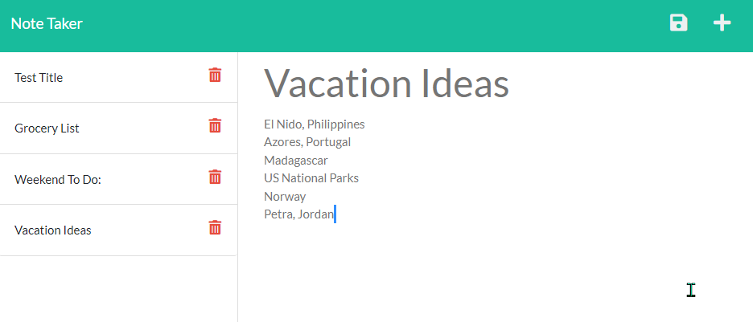

# Note Taker using Express.js

## Description
This application allows for the user to write, save and delete notes.

## Table of Contents

* [Description](#description)
* [User Story](#user-story)
* [Acceptance Criteria](#acceptance-criteria)
* [Usage](#usage)
* [Tech Used](#tech-used)
* [Website link](#website-link)
* [Contribution](#contribution)
* [Questions](#questions)
* [License](#license)

## User Story
```
AS A small business owner  
I WANT to be able to write and save notes  
SO THAT I can organize my thoughts and keep track of tasks I need to complete
``` 

## Acceptance Criteria
```
GIVEN a note-taking application  
WHEN I open the Note Taker  
THEN I am presented with a landing page with a link to a notes page  
WHEN I click on the link to the notes page  
THEN I am presented with a page with existing notes listed in the left-hand column, plus empty fields to enter a new note title and the note’s text in the right-hand column  
WHEN I enter a new note title and the note’s text  
THEN a Save icon appears in the navigation at the top of the page  
WHEN I click on the Save icon  
THEN the new note I have entered is saved and appears in the left-hand column with the other existing notes  
WHEN I click on an existing note in the list in the left-hand column  
THEN that note appears in the right-hand column  
WHEN I click on the Write icon in the navigation at the top of the page  
THEN I am presented with empty fields to enter a new note title and the note’s text in the right-hand column
```

## Usage
Simply click on the 'Get Started' button to open up the notes. Any previous written notes will appear on the left hand side. The application will automatically open up a new note and you can simply type in your title and text in the designated spots. To save your note, a 'save' button will appear in the top right hand corner once both a title and description text have been added. When you click on the 'save' button your note will automatically join all of the other saved notes on the left hand side. To delete any notes, simply click on the red trash can next to the designated note.

### Tech Used
* JavaScript
* HTML/CSS
* Node.js
* Express.js
* [UUID](https://www.npmjs.com/package/uuid)
* [BootStrap](https://getbootstrap.com/)

### Website Link
Check out the deployed app here: [Note Taker](https://damp-tundra-43822.herokuapp.com/)



## Contribution
If you would like to contribute to this project, please feel free to clone or fork the repo and submit your edits in a PR through a new branch. Upon testing and approval, it will be then be merged into the main branch. 

## Questions
✉️ Contact me with any questions: [email](mailto:jkjohnson673@gmail.com) , [GitHub](https://github.com/jjohnson673)


## License
This project is licensed under the [MIT License](https://choosealicense.com/licenses/mit).

Copyright (c) 2022 Julia Johnson

Permission is hereby granted, free of charge, to any person obtaining a copy
of this software and associated documentation files (the "Software"), to deal
in the Software without restriction, including without limitation the rights
to use, copy, modify, merge, publish, distribute, sublicense, and/or sell
copies of the Software, and to permit persons to whom the Software is
furnished to do so, subject to the following conditions:

The above copyright notice and this permission notice shall be included in all
copies or substantial portions of the Software.

THE SOFTWARE IS PROVIDED "AS IS", WITHOUT WARRANTY OF ANY KIND, EXPRESS OR
IMPLIED, INCLUDING BUT NOT LIMITED TO THE WARRANTIES OF MERCHANTABILITY,
FITNESS FOR A PARTICULAR PURPOSE AND NONINFRINGEMENT. IN NO EVENT SHALL THE
AUTHORS OR COPYRIGHT HOLDERS BE LIABLE FOR ANY CLAIM, DAMAGES OR OTHER
LIABILITY, WHETHER IN AN ACTION OF CONTRACT, TORT OR OTHERWISE, ARISING FROM,
OUT OF OR IN CONNECTION WITH THE SOFTWARE OR THE USE OR OTHER DEALINGS IN THE
SOFTWARE.
